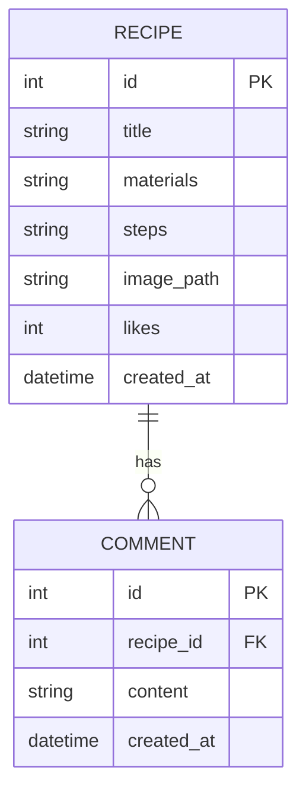

# DB DESIGN - 食譜收藏夾 資料庫設計

## 1. ER 圖（實體關係圖）

## 2. 資料表詳細說明

### RECIPE (食譜表)
用來儲存食譜的基本資訊、材料與步驟。

| 欄位名稱 | 型別 | 說明 |
| --- | --- | --- |
| `id` | INTEGER | 主鍵 (Primary Key)，自動遞增 |
| `title` | VARCHAR(100) | 食譜名稱 (必填) |
| `materials` | TEXT | 食譜材料清單 (必填) |
| `steps` | TEXT | 製作步驟 (必填) |
| `image_path` | VARCHAR(255) | 圖片的相對路徑 (例如 `uploads/xxx.jpg`)，允許空值 |
| `likes` | INTEGER | 按讚數量，預設為 0 |
| `created_at` | DATETIME | 建立時間，預設為當下時間 |

### COMMENT (留言表)
用來儲存訪客對於食譜的留言。

| 欄位名稱 | 型別 | 說明 |
| --- | --- | --- |
| `id` | INTEGER | 主鍵 (Primary Key)，自動遞增 |
| `recipe_id` | INTEGER | 外鍵 (Foreign Key)，對應 RECIPE.id，代表這則留言屬於哪篇食譜 |
| `content` | TEXT | 留言內容 (必填) |
| `created_at` | DATETIME | 建立時間，預設為當下時間 |

## 3. SQL 建表語法
完整的建表語法請參考 `database/schema.sql`。

## 4. Python Model 程式碼
採用 Flask-SQLAlchemy 實作，程式碼位於 `app/models/` 中。
