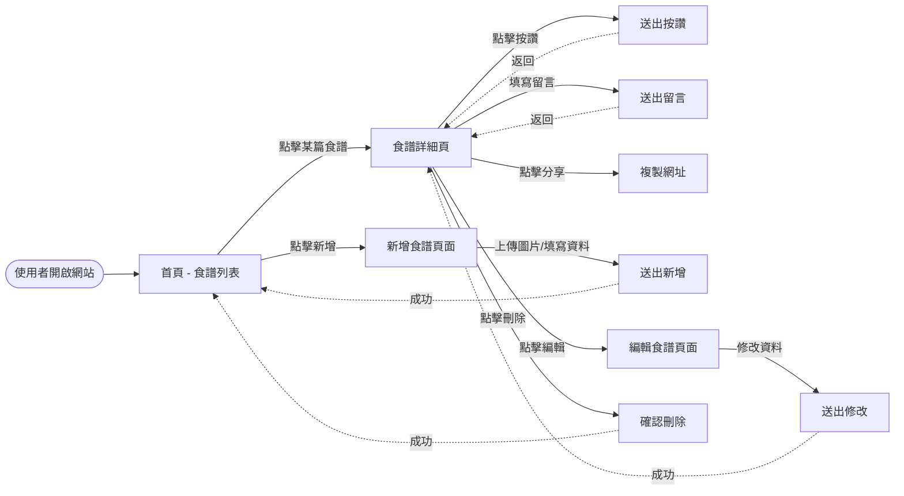
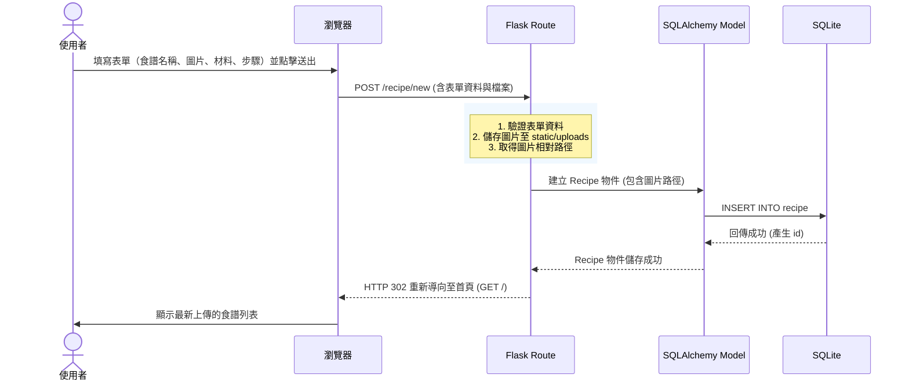

# FLOWCHART - 食譜收藏夾 流程圖設計

以下為根據系統架構與需求所設計的流程圖，包含使用者操作路徑以及系統內部的資料流動序列。

## 1. 使用者流程圖（User Flow）

此流程圖描述使用者從進入網站開始，可以進行的各種操作路徑。

## 2. 系統序列圖（Sequence Diagram）

此序列圖描述當使用者「新增食譜」時，資料從瀏覽器傳遞到資料庫的完整流程。

## 3. 功能清單與路由對照表

初步規劃的對應 URL 路徑與 HTTP 方法，以符合 RESTful 風格。

| 功能項目 | HTTP 方法 | URL 路徑 | 說明 |
| --- | --- | --- | --- |
| **瀏覽食譜列表** | `GET` | `/` 或 `/recipes` | 顯示所有食譜縮圖與基本資訊 |
| **查看食譜詳細** | `GET` | `/recipe/<id>` | 顯示特定食譜的完整材料、步驟與留言 |
| **新增食譜頁面** | `GET` | `/recipe/new` | 回傳新增食譜的 HTML 表單 |
| **送出新增食譜** | `POST` | `/recipe/new` | 接收表單資料，寫入資料庫並儲存圖片 |
| **編輯食譜頁面** | `GET` | `/recipe/<id>/edit` | 回傳帶有舊資料的編輯表單 |
| **送出編輯食譜** | `POST` | `/recipe/<id>/edit` | 更新資料庫中的該筆食譜資料 |
| **刪除食譜** | `POST` | `/recipe/<id>/delete`| 刪除資料庫中的特定食譜與相關留言 |
| **新增留言** | `POST` | `/recipe/<id>/comment`| 接收留言內容，寫入 Comment 資料表 |
| **按讚食譜** | `POST` | `/recipe/<id>/like` | 更新 Recipe 的按讚數 (可考慮用 AJAX) |
